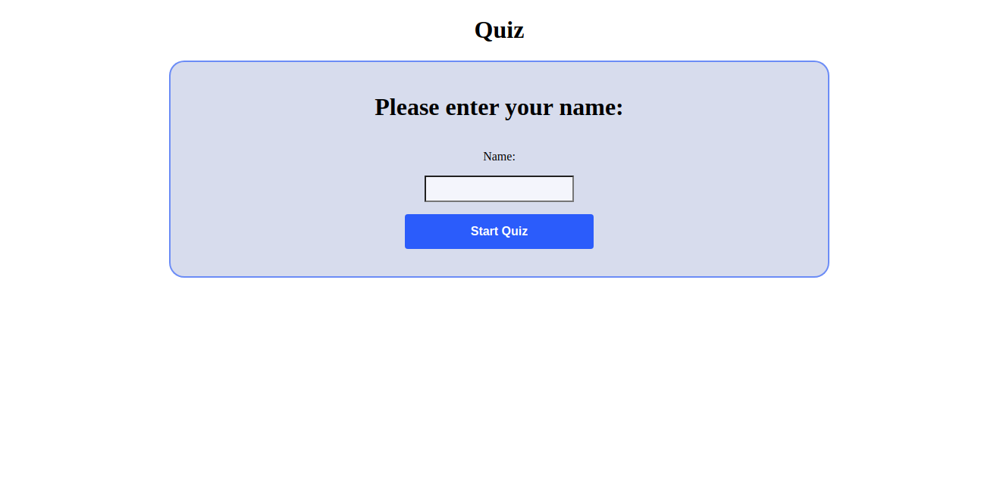

# A2 Quiz 

### Solution

The assignment was not difficulte in my oppinion, and since there where no requierments to use object orinted programing approch I choosed to do it as functional programing "only using functions that excute by trigging events in the page.

Since there where also no requierments to divide the code to multiple files I added all the code in one file. This might be not so optimal for any larger application, but it was the first time for me using javascript so this assignment was as a start and intreduction to the javascript.

### Installing

When you have cloned the repository start with:  
1. Start with opening your terminal and navigate to the repo using the command "cd".
2. When your in the root directory for the project start with the command "npm install" to download all nessecert resourses for the project.
3. To run the Application using vite write the command "npm run build" to build all nacessery resourses then use the command "npm run serve".
4. In your browser go to the link "http://localhost:4173/".
5. Now you can enjoy doing the quiz.  

### How to play

After installing the applicaton, running the server and start browsing the game, start with writing your name and hit The button "Start Quiz". 
The first question will appear and an asnwring field with a timer that you can see. Write your answer before the time runs out and hit the "Submit" button. Now if your answer is correct the next question will be shown to you, but if you were wrong then you will see a game over message and a "Restart" button if you want to try again.

 Note there are some question where you do not need to write an answer for but to choose between multiple ones that will be shown as click buttons.

When you are done with the quiz a victory message will appear with the total time it took you to solve the quiz. There will also be a high score list that you can see.

### The linters
there are some diffirent linters used in the devlopment process.
1. The style lint is used when the command "npm run stylelint". it shows if there any problem in the stykle sheet and you can use "npm run stylelint:fix" that trys to solve the problems and hopfuly fix them.
2. To check the html files use "npm run htmlhin" that scans the html files and tells you if there are any problems.
3. The "npm run eslint" is used to check the javascript files and your code and present the problems in the code. you can always try "npm run eslint:fix" that try to solve those problems.
4. Use "npm run lint" to run all the linters together.
5. Use the command "npm run jsdoc" to generate documentation to your code.
